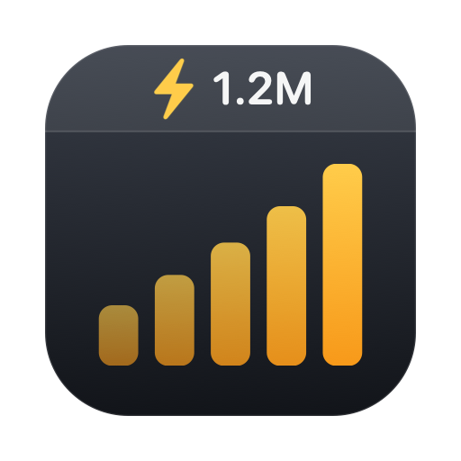
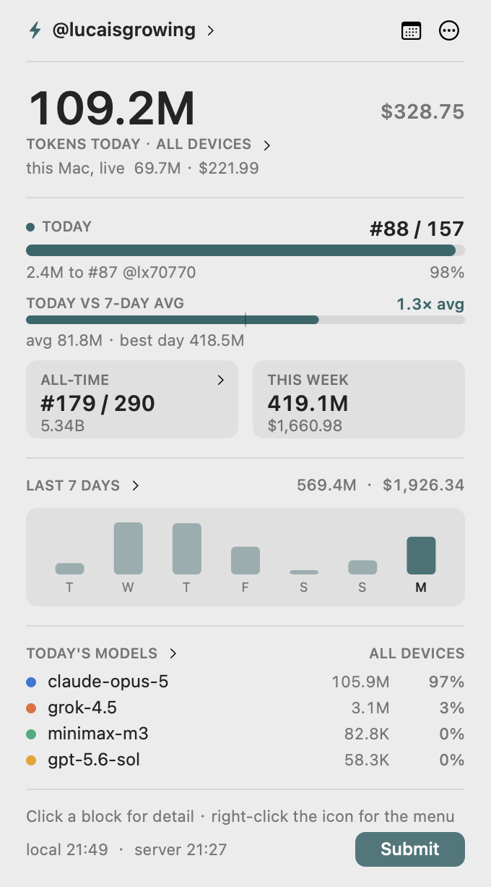
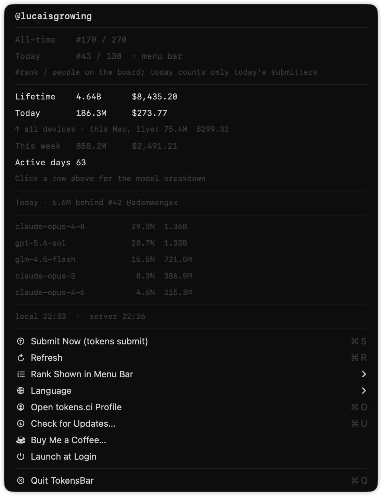
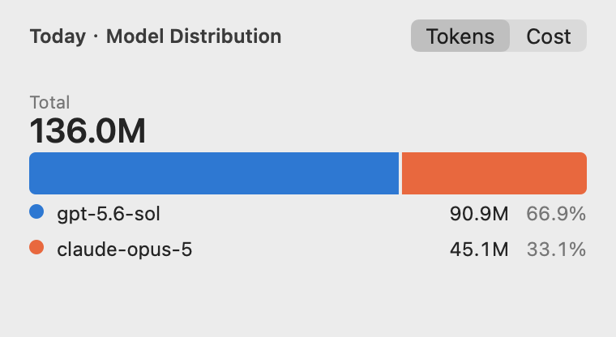
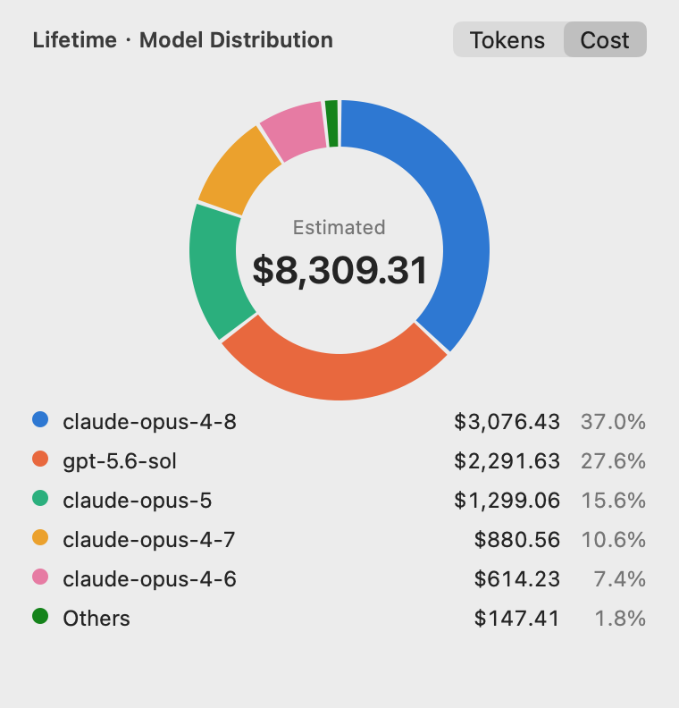
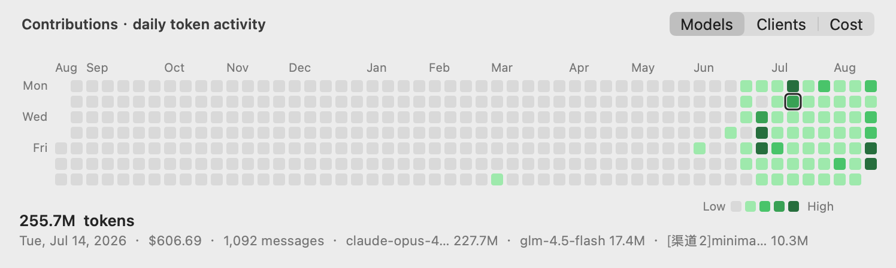

<div align="right">
  <a href="README.md"></a>
  <a href="README.zh-CN.md"></a>
</div>

<p align="center">
  
</p>

<h1 align="center">TokensBar</h1>

<p align="center">
  在 macOS 菜单栏上看 <a href="https://tokens.ci">tokens.ci</a> 的 token 用量和排名，不用再开网页。
</p>

<p align="center">
  <a href="https://github.com/lucaisgrowing/tokens-menubar/actions/workflows/build.yml"></a>
  <a href="https://github.com/lucaisgrowing/tokens-menubar/releases/latest"></a>
  <a href="LICENSE"></a>
  
  
</p>

Swift 编写，`swiftc` 直接编译，不需要 Xcode 工程，除了系统框架没有任何依赖。

<p align="center">
  
  
</p>

```
菜单栏:  ⚡ 12.4M  #87       ← 累计榜名次
  或:    ⚡ 12.4M  今#31     ← 当日榜名次
```

界面内置中英双语，默认英文，用下拉里的「语言 / Language」子菜单随时切换，也可以在 config.json 里写 `language` 设默认。

## 模型分布饼图

点**累计**或**今日**那一行，会在菜单栏图标下方弹出一个面板，里面是环形图，右上角带 Token / 费用 切换：

- **累计**用 API 的 `modelUsage`
- **今日**用本地 CLI 扫描的结果，所以是实时的，不用等下一次提交

前 5 个模型各占一块，其余折进「其他」—— 环形图超过 6 块就不好读了。只有一两个模型时会改画成一条 100% 的横条。浅色和深色模式各用一套配色，分别按各自背景做过对比度和色盲可分辨性校验。

面板打开、以及切换 Token / 费用 时，图表会有一段画入动效。鼠标悬停某一块（或图例里对应那一行），两边会同时高亮、其余变淡，中间的读数换成那个模型自己的数字。

<p align="center">
  
  
</p>

## 贡献图

下拉里的**活跃天数**那一行，点开是一年的每日 token 活动热力图，跟网站上那块是同一个视图。悬停某一天会读出当天的 token、花费、消息条数和各客户端占比；没悬停时显示活跃天数和统计区间。

<p align="center">
  
</p>

右上角的切换决定下方读数按什么拆分：**模型**、**客户端**、**金额**。切到金额时格子的深浅也会跟着变 —— token 的深浅用 API 给的强度，金额的深浅是按每日花费的四分位自己算的，所以「量大但便宜」和「量小但贵」两种日子看起来不一样。

色阶是单一色相由浅到深，浅色和深色模式各一套；只要当天有用量，就不会退回成空格子的颜色。

## 两个排名

- **累计榜** —— 历史总量的排名，也就是 tokens.ci 首页那个榜
- **今日榜** —— 只按当天提交量排，榜上只有当天提交过的人，所以人数少、名次跳动大

`#87 / 265` 是「第 87 名 / 榜上共 265 人」。当日名次在菜单栏里前面带个「今」字（`今#31`），用来跟累计名次区分。

菜单栏显示哪一个，用下拉里的「菜单栏显示排名」随时切换（选择会记住）；想改默认值就在 config.json 里写 `menuBarRank`。两个排名在下拉里始终都列出来，切换只影响菜单栏那一行、以及差距提示看的是哪个榜。

## 前提

需要先装好并登录 [`tokens`](https://github.com/missuo/tokens) CLI：

```bash
brew install owo-network/brew/tokens
tokens login
```

## 安装

去 [Releases](https://github.com/lucaisgrowing/tokens-menubar/releases) 下 `TokensBar.app.zip`，解压后拖进 `/Applications`，然后去掉隔离标记：

```bash
xattr -dr com.apple.quarantine /Applications/TokensBar.app
open /Applications/TokensBar.app
```

发布的包是 ad-hoc 签名、**没有公证**的，所以隔离标记不去掉 macOS 会直接拒绝打开。也可以右键 → 打开，或者去「系统设置 → 隐私与安全性」里点「仍要打开」。release 里的二进制是 universal（arm64 + x86_64），要求 macOS 13 以上。

也可以自己编，除了 Xcode 自带的 Swift 工具链什么都不需要：

```bash
git clone https://github.com/lucaisgrowing/tokens-menubar.git
cd tokens-menubar
./build.sh              # 只编本机架构
./build.sh --universal  # arm64 + x86_64
open TokensBar.app
```

app 是 `LSUIElement`，只在菜单栏出现，没有 Dock 图标和窗口。

图标是 `Resources/AppIcon.icns`，已经提交进仓库。它是用代码画的 —— 改 `Tools/make-icon.swift` 然后跑 `swift Tools/make-icon.swift` 重新生成。

## 配置

可选，`~/.config/tokens-menubar/config.json`：

```json
{
  "username": "your-github-username",
  "language": "en",
  "menuBarRank": "all",
  "apiRefreshSeconds": 300,
  "localRefreshSeconds": 120,
  "topModels": 5
}
```

| 键 | 默认 | 说明 |
| --- | --- | --- |
| `username` | 读 `~/.config/tokens/credentials.json` | tokens.ci 用户名 |
| `apiBase` | `https://tokens.ci` | API 地址 |
| `language` | `en` | 界面语言：`en` 或 `zh` |
| `menuBarRank` | `all` | 菜单栏默认显示哪个排名：`all` 累计榜 / `today` 当日榜 |
| `apiRefreshSeconds` | 300 | 拉服务端数据的间隔（最小 30） |
| `localRefreshSeconds` | 120 | 跑本地扫描的间隔（最小 30） |
| `topModels` | 5 | 下拉里列几个模型，0 = 不列 |

在菜单里切过排名或语言之后，记住的选择（`UserDefaults`）优先于 config.json。想让 config 重新生效：`defaults delete ci.tokens.menubar menuBarRank`（语言是 `language`）。

## 检查更新

「检查更新」把当前 bundle 版本和 GitHub 最新 release 比一下。后台每天也会静默查一次，有新版时这个菜单项会变成下载链接。不会自动装任何东西。

## 命令行

```bash
# 把菜单栏那行、整个下拉、以及两个图表的明细打到终端，便于排查数据链路
./TokensBar.app/Contents/MacOS/TokensBar --dump [--lang en|zh]

# 把整个图表面板离屏渲染成 PNG，用来预览布局
# dark = 深色模式，hover N = 第 N 块的悬停态，reveal F = 把画入动效冻结在进度 F
./TokensBar.app/Contents/MacOS/TokensBar --chart-png out.png \
    [today|lifetime] [tokens|cost] [dark] [hover N] [reveal F]

# 把贡献图离屏渲染成 PNG
./TokensBar.app/Contents/MacOS/TokensBar --contrib-png out.png \
    [models|clients|cost] [dark] [hover YYYY-MM-DD]

# 拿当前版本和 GitHub 最新 release 比一下
./TokensBar.app/Contents/MacOS/TokensBar --check-updates

# 跑菜单里「立即提交」走的同一条路径，便于在终端复现失败；加 --dry-run 则不真的上报
./TokensBar.app/Contents/MacOS/TokensBar --submit [--dry-run]

# 开机启动（装/卸 ~/Library/LaunchAgents/ci.tokens.menubar.plist）
./TokensBar.app/Contents/MacOS/TokensBar --set-login on
./TokensBar.app/Contents/MacOS/TokensBar --set-login off
```

菜单里的「开机启动」勾选项做的是同一件事。

## 工作原理

两个数据源：

- **排名、累计、模型占比** —— tokens.ci 的公开只读接口 `GET /api/users/<name>` 和 `GET /api/leaderboard?period=all|today`，不带任何凭据
- **今日、本周** —— 本地跑 `tokens --today --json` / `tokens --week --json`，所以是实时的，不用等下一次提交

两点值得知道：

- 下拉里的百分比是按 **token** 重算的占比。API 自带的百分比是按**花费**算的，两者会不一样
- 下拉里的「今日」是本机的本地扫描结果，而当日榜的名次来自服务端、会把账号下所有设备加起来；多台机器共用一个账号时，本机这个数会偏小

接口拉不通时，下拉会显示服务端读取失败，并保留上一次拿到的数据。

## 赞助

TokensBar 一直免费。如果它帮你省下了开网页的功夫，欢迎用 USDT 请杯咖啡，两条链都可以：

| 链 | 地址 |
| --- | --- |
| TRON（TRC20） | `TNKSjygE7JaMSJBPZcYPpWxVPUKrFr8DDU` |
| Ethereum · BNB Chain · Base（ERC20 / BEP20） | `0x027E4828B67f4c8cAc006A637Cab4f0164F501B8` |

<table align="center">
  <tr>
    <td align="center"><br><sub>TRON（TRC20）</sub></td>
    <td align="center"><br><sub>ERC20 / BEP20 / Base</sub></td>
  </tr>
</table>

转账前先确认链，两个地址不能混用。

## 引用与致谢

本项目只是给下面这些项目做了个菜单栏前端，核心的用量统计工作都是它们做的：

- [missuo/tokens](https://github.com/missuo/tokens) —— 本项目调用的 `tokens` CLI，以及 [tokens.ci](https://tokens.ci) 排行榜本身（MIT）
- [junhoyeo/tokscale](https://github.com/junhoyeo/tokscale) —— `missuo/tokens` 的上游（MIT）

TokensBar 没有复制上述项目的任何代码，只通过它们的 CLI 输出和公开只读 API 取数。与 tokens.ci 官方无隶属关系。

## 协议

[MIT](LICENSE)，与上游两个项目保持一致。


