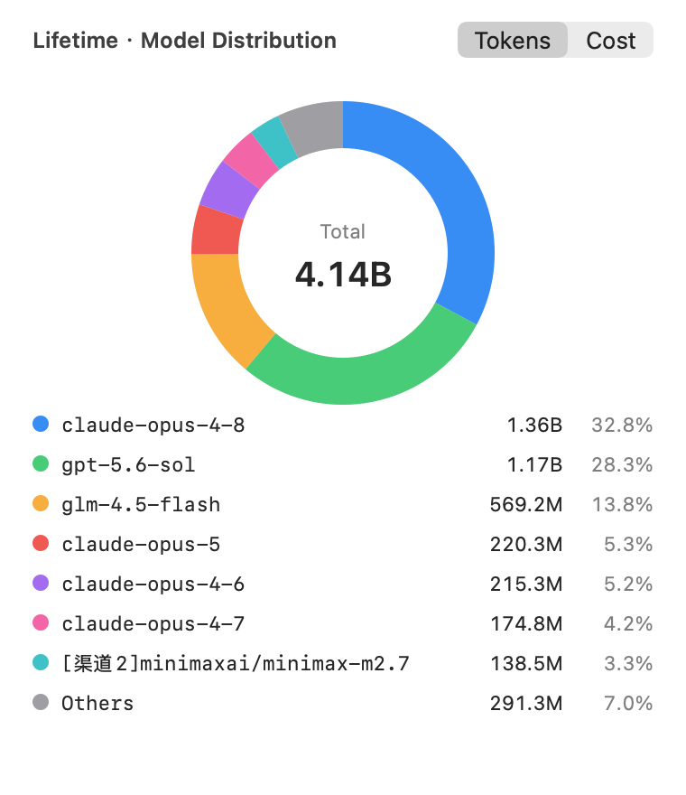
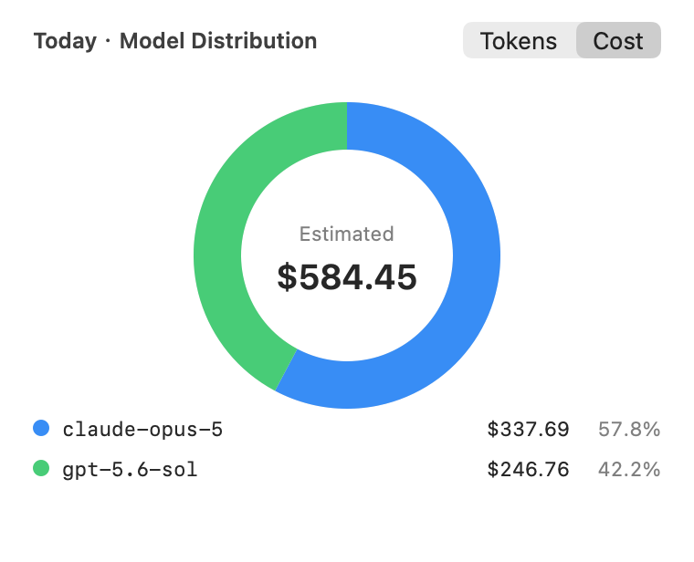

<div align="right">
  <a href="README.md"></a>
  <a href="README.zh-CN.md"></a>
</div>

<p align="center">
  
</p>

# TokensBar

在 macOS 菜单栏上看 [tokens.ci](https://tokens.ci) 的 token 用量和排名，不用再开网页。

[](https://github.com/lucaisgrowing/tokens-menubar/actions/workflows/build.yml)
[](https://github.com/lucaisgrowing/tokens-menubar/releases/latest)
[](LICENSE)


单文件 Swift，`swiftc` 直接编译，不需要 Xcode 工程，除了系统框架没有任何依赖。

```
菜单栏:  ⚡ 12.4M  #87       ← 累计榜名次
  或:    ⚡ 12.4M  今#31     ← 当日榜名次

下拉:
  @your-handle
  ──────────────────────────────
  累计榜     #87 / 265  · 菜单栏
  今日榜     #31 / 121
  #名次 / 榜上总人数；今日榜只算当天提交过的人
  ──────────────────────────────
  累计       1.82B      $3,410.55    ← 点开看饼图
  今日       12.4M      $54.30       ← 点开看饼图
  本周       210.6M     $612.40
  点上面任意一行看模型分布
  ──────────────────────────────
  累计榜 距 #86 @someone-ahead 还差 24.3M
  ──────────────────────────────
  claude-opus-4-8          33.6%  1.36B
  gpt-5.6-sol              28.1%  1.13B
  glm-4.5-flash            14.1%  568.2M
  ──────────────────────────────
  本地 12:21  ·  服务端 12:06
  立即提交 · 刷新 · 菜单栏显示排名 · 语言
  打开 tokens.ci 主页 · 检查更新 · 开机启动 · 退出
```

界面内置中英双语，**默认英文**（tokens.ci 本身是全英文的），用下拉里的「语言 / Language」子菜单随时切换，也可以在 config.json 里写 `language` 设默认。

## 模型分布饼图

点**累计**或**今日**那一行，会在菜单栏图标下方弹出一个面板，里面是环形图，右上角带 Token / 费用 切换：

- **累计**用 API 的 `modelUsage`
- **今日**用本地 CLI 扫描的结果，所以是实时的，不用等下一次提交

前 7 个模型各占一块，剩下的折进「其他」。数据刷新时面板会原地更新，不用重新打开。

<p align="center">
  
  
</p>

## 两个排名

- **累计榜** —— 历史总量的排名，也就是 tokens.ci 首页那个榜
- **今日榜** —— 只按当天提交量排，榜上只有当天提交过的人，所以人数少、名次跳动大

`#87 / 265` 读作「第 87 名 / 榜上共 265 人」，**不是两个不同的排名**。当日名次在菜单栏里前面带个「今」字（`今#31`），免得跟累计名次看混。

菜单栏显示哪一个，用下拉里的「菜单栏显示排名」随时切换（选择会记住）；想改默认值就在 config.json 里写 `menuBarRank`。两个排名在下拉里始终都列出来，切换只影响菜单栏那一行、以及差距提示看的是哪个榜。

## 前提

需要先装好并登录 [`tokens`](https://github.com/missuo/tokens) CLI：

```bash
brew install owo-network/brew/tokens
tokens login
```

## 安装

去 [Releases](https://github.com/lucaisgrowing/tokens-menubar/releases) 下 `TokensBar.app.zip`，解压后拖进 `/Applications`，然后去掉隔离标记：

```bash
xattr -dr com.apple.quarantine /Applications/TokensBar.app
open /Applications/TokensBar.app
```

发布的包是 ad-hoc 签名、**没有公证**的，所以隔离标记不去掉 macOS 会直接拒绝打开。也可以右键 → 打开，或者去「系统设置 → 隐私与安全性」里点「仍要打开」。release 里的二进制是 universal（arm64 + x86_64），要求 macOS 13 以上。

也可以自己编，除了 Xcode 自带的 Swift 工具链什么都不需要：

```bash
git clone https://github.com/lucaisgrowing/tokens-menubar.git
cd tokens-menubar
./build.sh              # 只编本机架构
./build.sh --universal  # arm64 + x86_64
open TokensBar.app
```

app 是 `LSUIElement`，只在菜单栏出现，没有 Dock 图标和窗口。

图标是 `Resources/AppIcon.icns`，已经提交进仓库。它是用代码画的 —— 改 `Tools/make-icon.swift` 然后跑 `swift Tools/make-icon.swift` 重新生成。

## 配置

可选，`~/.config/tokens-menubar/config.json`：

```json
{
  "username": "your-github-username",
  "language": "en",
  "menuBarRank": "all",
  "apiRefreshSeconds": 300,
  "localRefreshSeconds": 120,
  "topModels": 5
}
```

| 键 | 默认 | 说明 |
| --- | --- | --- |
| `username` | 读 `~/.config/tokens/credentials.json` | tokens.ci 用户名 |
| `apiBase` | `https://tokens.ci` | API 地址 |
| `language` | `en` | 界面语言：`en` 或 `zh` |
| `menuBarRank` | `all` | 菜单栏默认显示哪个排名：`all` 累计榜 / `today` 当日榜 |
| `apiRefreshSeconds` | 300 | 拉服务端数据的间隔（最小 30） |
| `localRefreshSeconds` | 120 | 跑本地扫描的间隔（最小 30） |
| `topModels` | 5 | 下拉里列几个模型，0 = 不列 |

在菜单里切过排名或语言之后，记住的选择（`UserDefaults`）优先于 config.json。想让 config 重新生效：`defaults delete ci.tokens.menubar menuBarRank`（语言是 `language`）。

## 检查更新

「检查更新」把当前 bundle 版本和 GitHub 最新 release 比一下。后台每天也会静默查一次，有新版时这个菜单项会变成下载链接。不会自动装任何东西。

## 命令行

```bash
# 把菜单栏那行、整个下拉、以及两个饼图的明细都打到终端，用来排查数据链路
./TokensBar.app/Contents/MacOS/TokensBar --dump [--lang en|zh]

# 把整个图表面板离屏渲染成 PNG，用来检查画得对不对
./TokensBar.app/Contents/MacOS/TokensBar --chart-png out.png [today|lifetime] [tokens|cost]

# 拿当前版本和 GitHub 最新 release 比一下
./TokensBar.app/Contents/MacOS/TokensBar --check-updates

# 开机启动（装/卸 ~/Library/LaunchAgents/ci.tokens.menubar.plist）
./TokensBar.app/Contents/MacOS/TokensBar --set-login on
./TokensBar.app/Contents/MacOS/TokensBar --set-login off
```

菜单里的「开机启动」勾选项做的是同一件事。

## 工作原理

两个数据源混着用：

- **排名、累计、模型占比** —— tokens.ci 的公开只读接口 `GET /api/users/<name>` 和 `GET /api/leaderboard?period=all|today&limit=100&page=N`。两个榜各翻页翻到自己那条为止，名次、榜上人数和上一名都从同一个有序列表里取，所以差距是自洽的。不带任何凭据。
- **今日、本周** —— 本地跑 `tokens --today --json` / `tokens --week --json`。服务端只有已提交的数据（`tokens serve` 默认 30 分钟一轮），本地扫描才是实时的，而且这两条各只要约 1 秒。

几个容易算错的地方，实现里已经处理：

- `totalTokens = input + output + cacheRead + cacheWrite + reasoning`
- `tokens --json` 顶层没有 `totalReasoning`，reasoning 得从 `entries[].reasoning` 自己加
- API `modelUsage[].percentage` 是**花费**占比不是 token 占比（便宜模型会显示 0.0% 却吃掉两位数百分比的 token），所以下拉里的百分比是本地按 token 重算的
- `GET /api/users/<name>?period=today` **不生效**，它照样回 `"period": "all"`，所以当日名次只能从当日榜列表里捞
- 下拉里的「今日」（本地扫描，仅本机）和当日榜的名次（服务端，多设备累加）不是同一个数，多台机器共用一个账号时前者会偏小
- GUI app 不继承 shell 的 `PATH`，`tokens` 二进制按 `/usr/local/bin` → `/opt/homebrew/bin` → `~/.cargo/bin` → `/usr/bin` 逐个探

如果 tokens.ci 走代理才通，注意它在 Cloudflare 后面：共享出口 IP 可能触发 managed challenge，此时接口会返回 403 的挑战页而不是 JSON，菜单里会显示成「服务端读取失败」。

## 引用与致谢

本项目只是给下面这些项目做了个菜单栏前端，核心的用量统计工作都是它们做的：

- [missuo/tokens](https://github.com/missuo/tokens) —— 本项目调用的 `tokens` CLI，以及 [tokens.ci](https://tokens.ci) 排行榜本身（MIT）
- [junhoyeo/tokscale](https://github.com/junhoyeo/tokscale) —— `missuo/tokens` 的上游（MIT）

TokensBar 没有复制上述项目的任何代码，只通过它们的 CLI 输出和公开只读 API 取数。与 tokens.ci 官方无隶属关系。

## 协议

[MIT](LICENSE)，与上游两个项目保持一致。


